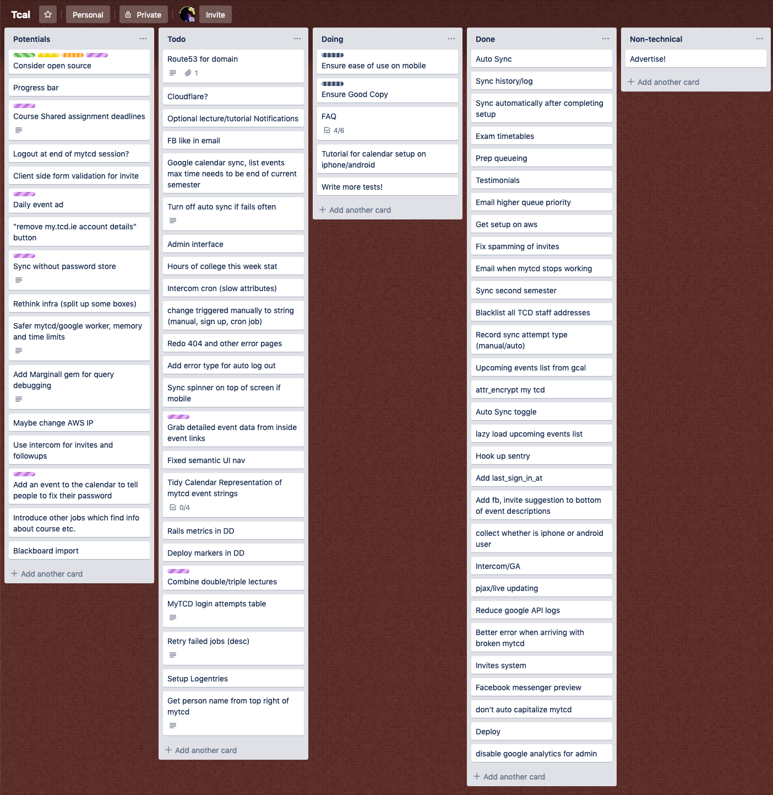

Tcal
====

[TODO Screenshot of UI]

## Overview

[Tcal](https://tcal.rory.ie/) was something I made for students in [TCD](https://www.tcd.ie/) to sync their timetable into Google Calendar.

**If you are looking for a method that currently works, click [HERE!](https://tcal.rory.ie/ics/)**

The reason it no longer exists is because it asked students for their [SITS (student portal)](https://my.tcd.ie) password and stored it securely, enabling a seamless experience.
Storing passwords in an encrypted yet recoverable format is not something I learned was "bad" later. I considered a few other options which I'll go through below.

I just wanted to build something cool, by myself and without jumping through the bureaucratic hoops of which Trinity is home to.

This wasn't something I realised was "bad" later... it was just the best way I could achieve a seamless experience (initially for myself and friends). It made it possible for a large number of students to sign up and never need to return as they could use the popular Apple/Google calendar apps instead of one of the universities many attempts at an "easy-to-use" lecture timetable.

Students would:

 - Sign in their with @tcd Google account, knowingly accepting Calendar read/write permission
 - Enter their portal login details (with a link to an [explanation in simple English](https://tcal.rory.ie/about))
 - Enjoy _not_ having to sign in to the portal everyday, navigate to the timetable page, wait 30s+ for the slow DB to respond... before later settling for a screenshot which goes stale any time a class changes

TODO When exam timetables came out after the initial release, I built a scraper for that too. This put 


#### How I got caught! (todo better title for this section)
TODO how I was caught/why you should use a VPN in college

#### UT Story

- 2017-12-08 [College Shuts Down Popular Trinity Calendar Service](http://www.universitytimes.ie/2017/12/college-shuts-down-popular-trinity-calendar-service/)
- 2017-12-10 [Tcal Shutdown at Odds With Trinity’s Fostering of Entrepreneurship](http://www.universitytimes.ie/2017/12/tcal-shutdown-at-odds-with-trinitys-fostering-of-entrepreneurship/)
- 2017-12-13 [Tcal Risked Student Data, Says College](http://www.universitytimes.ie/2017/12/tcal-risked-student-data-says-college/)

#### Trello Board

I used trello to manage feature ideas/requests and prioritise what to build. I added a purple label to some interesting features I never built.




## _"Interesting"_ files

- Models/Database
	- [User](app/models/user.rb) Represents a student user of the service. Includes methods for authentication, less trivial state checking and everyone's favourite: `do_the_feckin_thing!` (runs scraper => syncs calendar)
	- [SyncAttempt](app/models/sync_attempt.rb) Logs each scrape, start/end time, number of events changed, error string
	- [QueJob](app/models/que_job.rb) Adding methods to query the current job queue implemented using [Que](https://github.com/chanks/que)
	- [structure.sql](db/structure.sql) Automatically generated file containing the queries/statements to recreate the Postgres setup. Had to switch to the sql file over the usual `schema.rb` to support Que's usage of advanced Postgres features.
- Scrapers
  - [TimetableScraper](app/lib/timetable_scraper.rb) - The spaghetti monster delivering the core functionality! (either blame me OR the obscurity of the MyTCD authentication and template rendering...)
  - [GoogleCalendarSync](app/lib/google_calendar_sync.rb) A far more pleasant class. `sync_events!` takes in a list of gcal events objects. It creates/updates/deletes them using a simple matching procedure on non-primary "Tcal" calendar which it creates pre-sync if not present.
  - [TcdStaffScrape](app/lib/tcd_staff_scrape.rb) Downloads the public directory of staff emails so to give an error notice when signing up. Probably was a bit unnecessary.


## Some technical details

### Infra

Initially ran on Azure, then AWS... free credit and that.

Used two instances:

1. Port 80/443 for http open to public traffic running
  - Web App
  - Nginx Server
2. No public internet traffic
  - PostgreSQL database
  - Background worker doing the scraping

```
Azure/AWS ====================|
| [db + worker] <-> [web app] |
|=====vv===============^^^====|
     SITS             users
```
Firewall was setup to let traffic only pass in the direction of the arrows.
Obviously ssh was also available for me to update, configure and do some live debugging. To reach the DB/worker box which accepted no public incoming connections, I connected via the web box.


TODO further development

Something I could have done after

Found people in each course to accept to manage the timetable for their year...
Maybe two or three people could access the calendar, and it's automatically added for everyone else in that year.


sorry for no testing


###Running it:

No need... [really!](https://tcal.rory.ie/ics/)

But sure anyway....


Install Postgres (TODO version), Ruby `2.3.3`

```
create_db tcal_dev
TODO .env file example
rake db:create
rails s
```

<!--
`CREATE EXTENSION IF NOT EXISTS "citext";`-->
