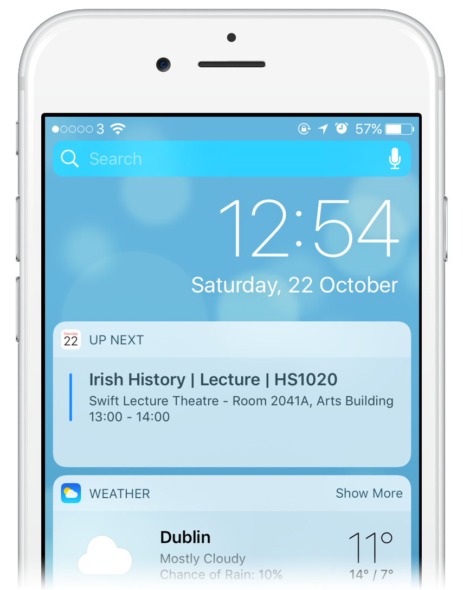

Tcal
====


#### Contents

- [About](#about)
- [How it worked](#how-it-worked)
- [Birth and Termination](#birth-and-termination)
- [Trello Board and Futher Development](#trello-board-and-further-development)
- [Source code overview](#source-code-overview)
- [Misc technical details](#misc-technical-details)

## About

Tcal was something I made for students in [Trinity College Dublin](https://www.tcd.ie/) to sync their timetable into Google Calendar.

Tcal no longer exists since it asked students for their [SITS (student portal)](https://my.tcd.ie) password. For this reason, I was asked by the university to shut it down and turn over the list of usernames. Storing passwords in an encrypted, yet recoverable, format is something I knew was considered _"bad"_ before the initial launch. I explored a few alternative options while ideating, but chose to use this method as it was the best way I could achieve a seamless experience.

Initially, I just wanted to build something cool, by myself and without jumping through the bureaucratic hoops of which tcd is home to.



For a growing number of students, it made it possible to set it up and successfully never need to return. One could use the well designed, pre-installed Apple and Google calendar apps instead of one of the universities many attempts at proprietary apps and yearly web portal iterations.


## How it worked

Students would:

 - Sign in their with @tcd Google account, knowingly accepting to share only their email address and Calendar read/write permissions
 - Enter their portal login details (with a link to [an explanation in simple English](https://tcal.rory.ie/about))
 - Enjoy _not_ having to sign in to the portal everyday, navigate to the timetable page, wait 30s+ for the snail DB to respond... before later settling for a screenshot which goes stale once a class changes. 

**The result.**  _(my timetable in Gcal)_


**The "setup wizard"**


Once logged in, students were provided with:

- The next few class times and venues
- The ability to manually trigger a sync
- A list of recent manual/auto attempts to sync, whether they succeeded and how many events were changed
- The ability your friends by email

When exam timetables came out in the Winter of 2016, I built a scraper for that too. This put each exam time, place, course code, student exam number and even [seat number](#Reveal-seat-numbers) into your calendar.


## Birth and Termination

During and after its life, I was asked by some why it was run anonymously. There wasn't one sole reason.

Very early on, I attempted making an existing program to work for my own timetable. A friend of mine had [written one](https://github.com/jameseggers/tcd-calendar) when he was in CS. However, it connected with the calendar in a way Google no-longer allows. The college portal pages had also changed slightly since it was written, requiring changes to the way lecture times were gathered from them.

I'm not certain exactly at which point I started planning it as a web-app, however I knew web would be necessary for the secure "sign-in with Google" functionality (unless I was to force my non-CS friends to get their own API keys). A web-app removed the requirement for users to understand how to download and run the code themselves with an added benefit of running it for them once a day, catching up with any timetable changes.

The group of people who were to be the first customers/testers were a few of my new class mates and I didn't want to come across as a [narcissist](https://upload.wikimedia.org/wikipedia/en/f/f8/Thefacebook.png). As I shared it with more groups of people, I decided to hold back on putting a/my name on it. At the bottom of email based communications, I included "Tcal is not an official Trinity College service". Anyone could reply to one of these emails or contact me through the [in-app messenger](https://www.intercom.com/customer-support-software) and ask whatever. No one came asking for my identity directly but I did end up meeting some users IRL, which was no problem.

#### How it was found

The program logged in on behalf of 1300+ students around ~200k times between October 2016 and December 2017. In October of 2017 only a few days before Tcal's first birthday, I received an email from IT services asking me to visit them ASAP. In that meeting, they treated me as a victim of phishing attack on the college. Within a few minutes, I heeded the fact they knew I was the creator. Although I'm not certain, their abnormal questioning didn't suggest I were the target of this _attack_ or _breach_. I chose to simply denounce myself at that moment rather than playing their silly game any further.

Before the conversation arrived at that state, they told me I was one of a few students who was asked to visit based on the fact I had visited that site! I loaded homepage almost daily using college internet to check that it was online, accept any pending invites, respond to questions, etc. Therefore, my DNS lookup count would have been higher than anyone else.

A subsequent meeting with the Junior Dean and a [Data Protection Comission](https://www.dataprotection.ie/) representative was the moment I was asked to shut it down.


Some users were very unhappy.

> What an absolute travesty. If there's anything that can be done to make this not happen please contact me, I can rally a crowd in your favour. I can't bear going back to screenshots.


> I am deeply saddened by this news. The service will be greatly missed.


[Further responses here](post-disable-reaction.md)


#### Morals of the story

- Don't store passwords
- If you're a student, in any university, or any internet user for that matter, use a VPN everywhere and always. I doubt TCD are monitoring all outgoing traffic and doing reverse lookups, but they are legally obliged to log all DNS requests (i.e. what site you type into the address bar and when is associated with your student number: creepy).


#### UT Story

- 2017-12-08 [College Shuts Down Popular Trinity Calendar Service](http://www.universitytimes.ie/2017/12/college-shuts-down-popular-trinity-calendar-service/)
- 2017-12-10 [Tcal Shutdown at Odds With Trinity’s Fostering of Entrepreneurship](http://www.universitytimes.ie/2017/12/tcal-shutdown-at-odds-with-trinitys-fostering-of-entrepreneurship/)
- 2017-12-13 [Tcal Risked Student Data, Says College](http://www.universitytimes.ie/2017/12/tcal-risked-student-data-says-college/)


## Trello Board and further development

I used trello to manage feature ideas/requests and prioritise what to build. I added a purple label to some interesting features I never built.


### Further Development

Some ideas I had... which I really should have built in time!
 
- **Integrate assignment deadlines:** Anyone could submit thee title and due date of an assignment (or other relevant event for a class) on the tcal site. It could then randomly select two people who take the same class with `Correct` and `Wrong` buttons. That event would then be added for everyone who took that class if both people hit `Correct`. If the mails get no response, it could ask someone else. 
- **Timetables without password storage and scraping:** using the method described above, I could have kept Tcal online by letting people (or possibly a class rep or elected "Tcal rep") to maintain the timetable in their own calendar. Tcal could then deal with making that calendar available to everyone. Another method I considered for people who didn't trust the service with their password was to visit the timetable page, right-click, view-source and paste it into the web-app which would then parse it for them.
- **Student Deals/TARGETED ADVERTISING!!!:** One of the more _outlandish_ ideas I began developing was a way in which societies, the student union or even business in town could essentially advertise to students inside the calendar.
  - The heads of societies would have special access to enter upcoming events into Tcal. Any student could then subscribe to events for whichever societies they like and see them in the same place as their lectures.
  - While thinking about possible revenue streams, I considered building something which would allow a coffee shop, for example, to offer their student deal as an event inside the calendar. It could automatically appear for students whichever hour they have a break on that day (rather than overlapping with their classes). By including a single-use link in the event description, it could have been possible to limit the total number of redemptions and/or how many times one person could use it. A system such as this would have driven user growth through people wanting the same as their friends while also allowing businesses to directly monitor the return on their investment.

I opted to abandon the project instead though and stop dealing with class timetables 🙃

## Source code overview

The app was written in [Ruby on Rails](https://rubyonrails.org/).

Rails projects include a lot of boilerplate files. Here's a list of the _"interesting"_ stuff:

- Scrape and Sync
  - [TimetableScraper](app/lib/my_tcd/timetable_scraper.rb) - The spaghetti monster delivering the core functionality! (either blame me OR the obscurity of the mytcd authentication and template rendering...). This file logs in on behalf of a student and extracts timetable information.
  - [GoogleCalendarSync](app/lib/google_calendar_sync.rb) A far more pleasant class. `sync_events!` takes in a list of gcal events objects. It creates/updates/deletes them using a simple matching procedure on non-primary "Tcal" calendar which it creates pre-sync if not present.
  - [TcdStaffScrape](app/lib/tcd_staff_scrape.rb) Downloads the public directory of staff emails so to give an error notice when signing up. Probably a bit overkill.

- Models/Database
  - [User](app/models/user.rb) Represents a student user of the service. Includes methods for authentication, less trivial state checking and everyone's favourite: `do_the_feckin_thing!` (runs scraper => syncs calendar).
  - [SyncAttempt](app/models/sync_attempt.rb) A single scrape event containing the start/end time, number of events changed, error string.
  - [QueJob](app/models/que_job.rb) Adding methods to query the current job queue, extending the functionality of the [Que](https://github.com/chanks/que) gem.
  - [structure.sql](db/structure.sql) Automatically generated file containing the queries/statements to recreate the Postgres setup. Had to switch to the sql file over the usual `schema.rb` to support Que's usage of advanced Postgres features. This may seem complicated but proved far more manageable than running a separate queue store (e.g. redis).


If you're interested in how the UI, "setup wizard" etc. worked, check out

- [controllers](app/controllers) HTTP endpoints
- [views](app/views) HTML templates
- [stylesheets](app/assets/stylesheets) Mainly includes small changes to [Semantic UI](https://semantic-ui.com/) (the css framework I used)
- [javascripts](app/assets/javascripts) A sprinkle of front-end _magic!_
- [mailers](app/mailers) Few notifications. The corresponding templates can be found in views


## Misc technical details

### Infra

Initially ran on Azure, then AWS... free credit and that.

```
Azure/AWS ====================|
| [db + worker] <-> [web app] |
|=====vv===============^^^====|
     SITS             users
```


Used two instances:

- **Web**
  - Web App
  - Nginx Server
  - Port 80/443 for http open to public traffic running
- **Worker**
  - PostgreSQL database
  - Background worker doing the scraping
  - No incoming traffic


Firewall was setup to let traffic only pass in the direction of the arrows.
Obviously ssh was also available for me configure the servers, update the software and do occasional live debugging. To reach the DB/worker box, I connected via the web box.


### Running it:

No need... seriously!

There is now an official method by connecting your calendar with blackboard. I describe [how to set that up here.](https://tcal.rory.ie/ics/)


But sure here it is anyway...

Install Ruby and PostgreSQL.

The versions I was using were: `Ruby 2.3.3` and `PostgreSQL 9.6.2`. The latest ones _should_ work, however.

```bash
# Clone it 
git clone git@github.com:RoryDH/tcal.git
cd tcal

# create the database
create_db tcal_dev

# create an env file
touch .env
# inside .env, place values for the environment variables used in config/secrets.yml
# only SECRET_KEY_BASE, ENCRYPTED_MY_TCD_PASSWORD_KEY and the GOOGLE_ ones are required to get started
# generate a SECRET_KEY_BASE using: bundle exec rake secret
# for generating a ENCRYPTED_MY_TCD_PASSWORD_KEY, see the readme for the gem https://github.com/attr-encrypted/attr_encrypted

# install gems (libraries)
bundle install

# setup the database
bundle exec rake db:setup

# start the webserver
bundle exec rails s

# visit localhost:3000 in your browser
```

I haven't actually tried the above setup recently. If something isn't working, google it. Still stuck? [Open an issue.](https://github.com/rorydh/tcal/issues)

For newer versions of rails, anywhere `rake` is used, use `rails` instead. 


### Testing

😅

If you were a user and are aware of the value of automated unit/integration tests, I want to sincerely apologise for not writing any.


### Reveal seat numbers

1. Go to your exam timetable page on mytcd
2. Bookmark the page
3. Edit the bookmark and change the address/URL to be the code below rather than https://my.tcd.ie/...


```javascript
javascript:(function(){var t=document.getElementsByClassName("sitstablegrid")[1];t.innerHTML=t.innerHTML.replace(/<!---/g, '').replace(/--->/g, '');})()
```

4. Clicking the bookmark when on the exam page will show your seat number beside each exam.


Here's that code expanded:

```
javascript:(
  function() {
    var table = document.getElementsByClassName("sitstablegrid")[1];
    table.innerHTML = table.innerHTML.replace(/<!---/g, '').replace(/--->/g, '');
  }
)()
```

